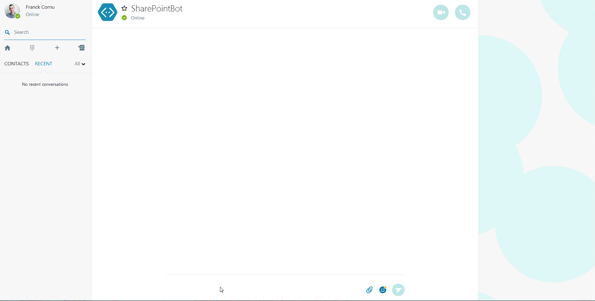
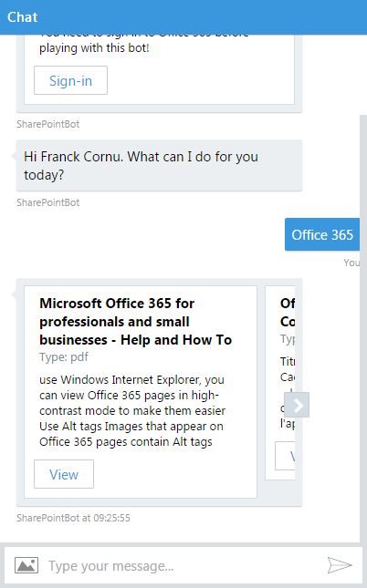
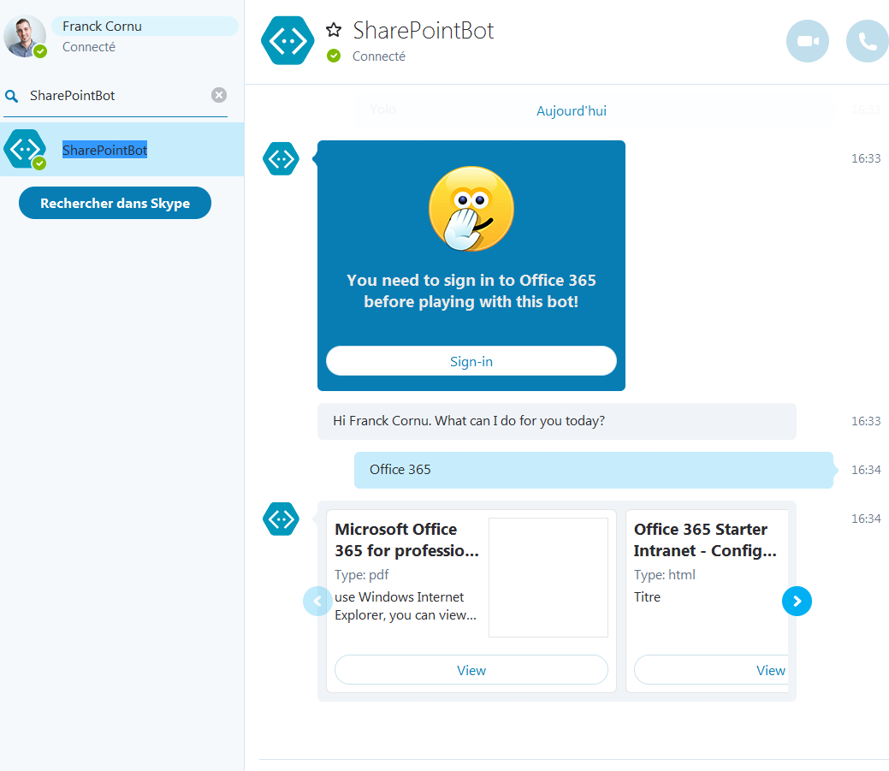
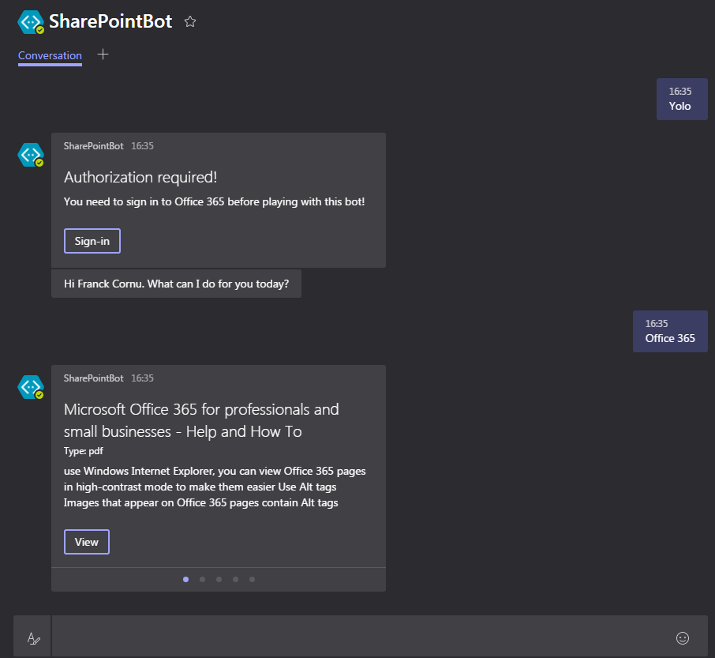

# SharePoint bot using the Bot Framework, QnA maker, OAuth2 and Node.js #

### Summary ###

In this sample, I show you how to implement a QnA bot for SharePoint Online by using search queries as dynamic answers in the knowledge base. From a functional point of view, it is simple solution to improve search capabilities for users in an intranet solution rather than using regular SharePoint search query rules. From a technical point of view, the main objective is to show you how to implement bots with an authentication mechanism to access OAuth2 protected APIs (like SharePoint, Graph, etc.).

In addition, to see this bot in action in a real intranet context, you can use it with to the [PnP Starter Intranet solution for SharePoint Online](https://github.com/SharePoint/PnP/tree/master/Solutions/Business.StarterIntranet).

Sign in experience

    

<table style="margin: 0px auto;">
  <tr>
    <th>
        
Web Chat Channel

        

            
        

    </th>
    <th>
        
Skype Channel

        

            
        

    </th>
    <th>
        
Microsoft Teams Channel

        

            
        

    </th>
  </tr>
</table>

<table style="margin: 0px auto;">
  <tr>
    <th>
      
Integration with the PnP Starter Intranet solution

      

        
      

    </th>
  </tr>
</table>

### Documentation #

The complete documentation of this sample is available [here](http://thecollaborationcorner.com/2017/01/25/search-for-your-sharepoint-content-from-a-bot-using-the-bot-framework-oauth2-and-node-js).

### Solution ###
Solution                | Author(s)
------------------------|----------
SharePointBot | Franck Cornu (MVP Office Development at [aequos](https://www.aequos.ca)) - Twitter @FranckCornu 

### Version history ###
Version  | Date | Comments
---------| -----| --------
1.0 | January 26th 2017 | Initial release
1.1 | April 9th 2017 | Added the QnA maker support

### Disclaimer ###

THIS CODE IS PROVIDED AS IS WITHOUT WARRANTY OF ANY KIND, EITHER EXPRESS OR IMPLIED, INCLUDING ANY IMPLIED WARRANTIES OF FITNESS FOR A PARTICULAR PURPOSE, MERCHANTABILITY, OR NON-INFRINGEMENT.

----------

# Installation (overview) #

1. Create a new QnA knowledge base (https://qnamaker.ai) and add it some values. Train and publish the KB.
2. Create a new Azure Node JS empty web app and deploy the bot code. I suggest you to use a forked version of this repository as deployment source for the web app
3. Set the Node JS environment variables corresponding to your setup in the web application settings:

Variable | Comment | Sample value
-------- | ------- | ------------
REDIRECT_URI | This URL will be used for the Azure AD Application to send the authorization code (must be the same as the one configured in the AAD app) | "<your_bot_azurewebsite_url>/api/oauthcallback"
TENANT | The tenant Id or domain name | "<your_company>.onmicrosoft.com"
RESOURCE | The resource endpoint we want to give access to (in this case, SharePoint Online) | "https://<your_company>.sharepoint.com"
AAD_CLIENT_ID | The client Id retrieved from the Azure AD App | "3c837f67-1f08-4a89-8e46-e8ab75f2ec22"
AAD_CLIENT_SECRET | The client secret retrieved from the Azure AD App | "e+8eV0GHACfvb7kYrX2KkqC1RzNEYqK8tHW4piYlNZg="
QNA_KNOWLEDGEBASE_ID | The QnA Maker knowledge base Id. You can get this info in the "Settings" tab in the QnA maker portal | "b8fa0f6e-43f1-406f-820f-49f2a7122073"
QNA_SUBSCRIPTION_KEY | Same as above | "b1d488a60f684d75959f967c53ad6b07"
BOT_MICROSOFT_APP_ID | The bot id retrieved form the Bot Framework portal  | "a0095b82-a596-450f-957a-a62b858b75cf" 
BOT_MICROSOFT_APP_PASSWORD | The bot app password retrieved form the Bot Framework portal. This password is only visible at the bot creation step | "o4cB3gckew7tqtTnvLUPiK1"

4. Create an new Azure AD Application (refer to the URL below to know how). Set the reply url to point to web application (e.g <your_bot_azurewebsite_url>/api/oauthcallback). Get the client is and secret and update the web app settings.
5. Register a new bot in the Bot framework portal (https://dev.botframework.com/). Update the web app settings.
6. Configure the bot service messaging endpoint URL with your Azure website URL (e.g <your_bot_azurewebsite_url>/api/messages)
7. Use it with different channels!
8. (Optional) Integrate the bot with the [PnP Starter Intranet solution](https://github.com/FranckyC/PnP/tree/feature/starter-intranet-v1.3/Solutions/Business.StarterIntranet#configure-the-qna-bot).

See this [URL](http://thecollaborationcorner.com/2017/01/25/search-for-your-sharepoint-content-from-a-bot-using-the-bot-framework-oauth2-and-node-js) to see the complete step-by-step guide.
